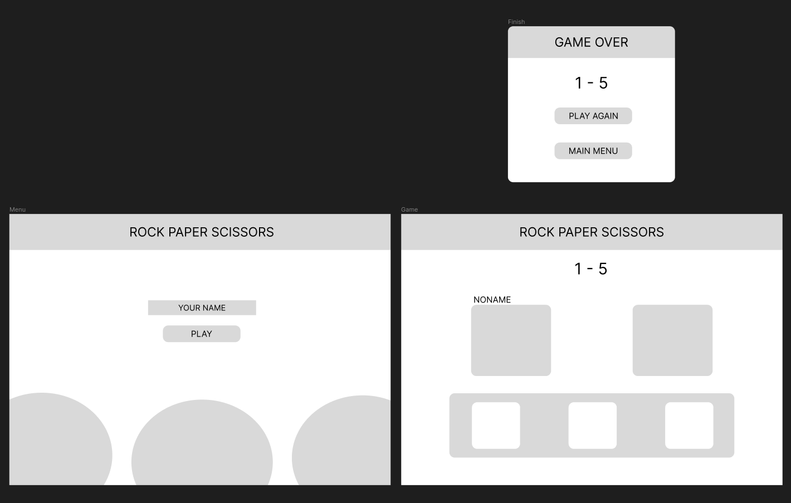
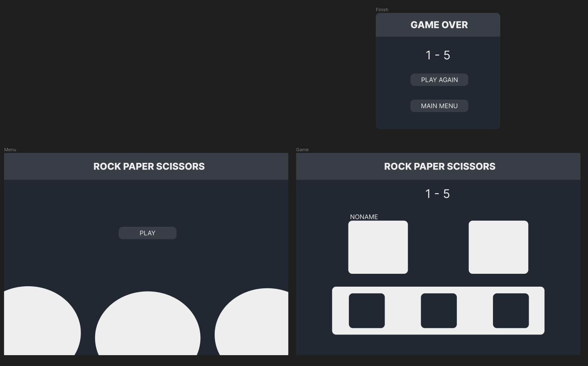
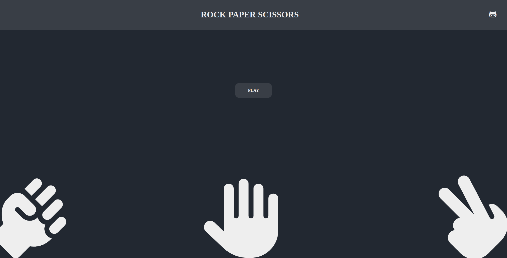
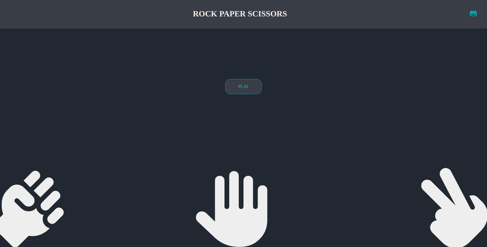
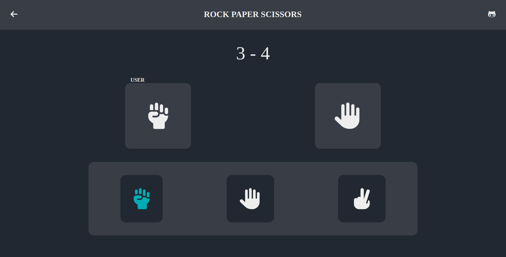
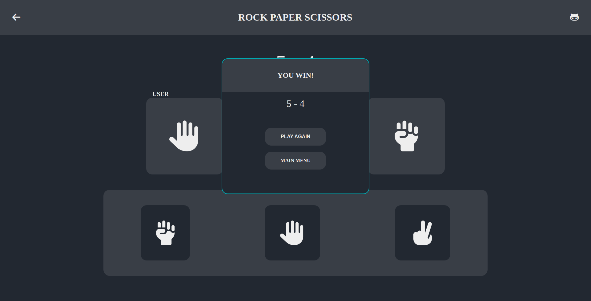

# Rock-Paper-Scissors

Rock-Paper-Scissors game created with html, css and js.

## About the Game

The project is from [The Odin Project](https://www.theodinproject.com/lessons/foundations-rock-paper-scissors) curriculum.

### Features

- It's a normal rock-paper-scissors game best of 5 rounds
- It's not support responsive design ([game screenshots](#game-screenshots))

### Tools and technology

- Visual Studio Code
- Linux Terminal
- Font Awesome Icons
- Figma
- Git and GitHub
- HTML and CSS
- JavaScript
- Color Hunt (I use this [palette](https://colorhunt.co/palette/222831393e4600adb5eeeeee))

## Screenshots

### Design in Figma

#### Adding colors!! (using the palette)

### Game Screenshots

#### Main menu

#### Hover effect

#### Game in action

#### Finish menu

## Author

[Sergio García](https://github.com/sergiogarciiam)

## License

This project is open source and available under the [MIT License](./LICENSE).
